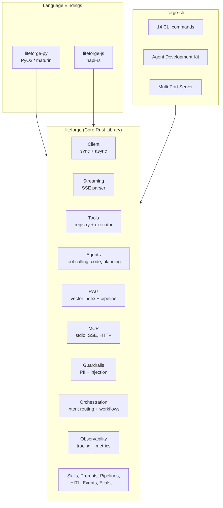

# LiteForge (Rust)

[](https://www.rust-lang.org)
[](https://www.python.org)
[](https://nodejs.org)

**LiteForge** is a high-performance Rust SDK for building LLM applications, with first-class Python bindings via PyO3 and JavaScript/TypeScript bindings via napi-rs. Provides a unified interface for LLM completions, streaming, tool calling, RAG, agents, guardrails, MCP, observability, and a full-featured CLI with an Agent Development Kit.

## Feature Matrix

Every module in the core Rust SDK is exposed to all three language targets:

| Module | Description | Rust | Python | JS/TS |
|--------|-------------|:----:|:------:|:-----:|
| **Client** | Sync & async LLM completions via OpenAI-compatible API | x | x | x |
| **Streaming** | Server-Sent Events (SSE) token-by-token streaming | x | x | x |
| **Tools** | Function-calling framework with registry, executor, schema validation | x | x | x |
| **Agents** | Tool-calling, code-execution, and planning agents | x | x | x |
| **RAG** | Vector indexing, retrieval, and generation pipeline | x | x | x |
| **Knowledge** | Document storage and retrieval backends | x | x | x |
| **Guardrails** | PII detection/redaction and prompt injection detection | x | x | x |
| **MCP** | Model Context Protocol client (stdio, SSE, HTTP transports) | x | x | x |
| **Skills** | Composable prompt-based skills (summarize, translate, extract, etc.) | x | x | x |
| **Prompts** | Template engine with variable substitution and prompt libraries | x | x | x |
| **Pipelines** | Multi-step LLM processing pipelines with branching | x | x | x |
| **Orchestration** | Multi-agent orchestration with intent routing and workflows | x | x | x |
| **Conversation** | Context window management with auto-compacting | x | x | x |
| **HITL** | Human-in-the-loop approval workflows | x | x | x |
| **Observability** | Distributed tracing (spans) and metrics collection | x | x | x |
| **Events & Hooks** | Pub/sub event bus and lifecycle hook system | x | x | x |
| **Evals** | Evaluation framework (exact, regex, similarity, JSON matching) | x | x | x |
| **Images** | Image generation, editing, and variations | x | x | x |
| **Automation** | Scheduled task automation with retry | x | x | x |
| **Scheduler** | Cron, interval, and one-shot job scheduling | x | x | x |
| **Triggers** | Event-driven execution (webhooks, file watch, queues, schedules) | x | x | x |
| **Retry** | Exponential backoff with jitter for transient errors | x | x | x |
| **Chunking** | Text splitting (fixed, recursive, sentence, paragraph) | x | x | x |

## Installation

### Quick Install (CLI)

**macOS / Linux:**
```bash
curl -fsSL https://raw.githubusercontent.com/seanpoyner/liteforge/main/scripts/install.sh | bash
```

**Windows (PowerShell):**
```powershell
irm https://raw.githubusercontent.com/seanpoyner/liteforge/main/scripts/install.ps1 | iex
```

**Homebrew (macOS / Linux):**
```bash
brew install seanpoyner/forge/forge-cli
```

The installer downloads the pre-built `forge` binary from the latest GitHub release
(falling back to a source build), prompts for your API key, and writes config to
`~/.forge/config.toml`. To run unattended, set `LITEFORGE_API_KEY` and pass
`--non-interactive`. See the [Installation Guide](docs/installation.md) for details.

### SDK-Specific Install

**Python** ([PyPI](https://pypi.org/project/liteforge/)):
```bash
pip install liteforge
```

**Rust** ([crates.io](https://crates.io/crates/liteforge)):
```bash
cargo add liteforge
```

**JavaScript / TypeScript** (npm):
```bash
npm install @seanpoyner/liteforge
```

## Quick Start

### Rust (Sync)

```rust
use liteforge::{ForgeClient, Message};

fn main() {
    let client = ForgeClient::new();
    let response = client.complete(vec![
        Message::user("What is the capital of France?")
    ]).unwrap();
    println!("{}", response.content().unwrap_or(""));
}
```

### Rust (Async + Streaming)

```rust
use futures::StreamExt;
use liteforge::{AsyncForgeClient, Message};

#[tokio::main]
async fn main() {
    let client = AsyncForgeClient::new();
    let mut stream = client.complete_stream(vec![
        Message::user("Tell me a short story about a robot.")
    ]).await.unwrap();

    while let Some(Ok(chunk)) = stream.next().await {
        if let Some(content) = chunk.content() {
            print!("{}", content);
        }
    }
}
```

### Python

```python
from liteforge import ForgeClient

client = ForgeClient()
response = client.complete([{"role": "user", "content": "Hello!"}])
print(response["choices"][0]["message"]["content"])
```

### Python (Async)

```python
import asyncio
from liteforge import AsyncForgeClient

async def main():
    client = AsyncForgeClient()
    response = await client.complete([{"role": "user", "content": "Hello!"}])
    print(response["choices"][0]["message"]["content"])

asyncio.run(main())
```

### JavaScript / TypeScript

```javascript
import { AsyncForgeClient, createMessageUser } from '@seanpoyner/liteforge';

const client = new AsyncForgeClient();
const response = await client.complete([
  createMessageUser('What is the capital of France?')
]);
console.log(response.choices[0].message.content);
```

### JavaScript Streaming

```javascript
import { AsyncForgeClient, createMessageUser } from '@seanpoyner/liteforge';

const client = new AsyncForgeClient();
const stream = await client.completeStream([
  createMessageUser('Tell me a story')
]);

let chunk;
while ((chunk = await stream.next()) !== null) {
  const content = chunk.choices[0]?.delta?.content;
  if (content) process.stdout.write(content);
}
```

## CLI Quick Start

```bash
# Chat with an LLM
forge chat "What is the capital of France?"
forge chat --stream "Tell me a story"
forge chat -i                            # interactive REPL

# List available models
forge models list

# Manage configuration and secrets
forge config show
forge config set-secret forge-api-key

# Start the multi-port agent server
forge serve

# Scaffold and develop an agent project
forge adk init my-agent
forge adk dev
```

See the [CLI Reference](docs/cli.md) for all 14 subcommands.

## SDK Feature Highlights

### Tool Calling

```rust
use serde_json::json;
use liteforge::tools::{FnTool, ToolRegistry, ToolExecutor};

let calculator = FnTool::new(
    "calculator", "Perform math operations",
    json!({"type": "object", "properties": {
        "op": {"type": "string"}, "a": {"type": "number"}, "b": {"type": "number"}
    }, "required": ["op", "a", "b"]}),
    |args| {
        let a = args["a"].as_f64().unwrap_or(0.0);
        let b = args["b"].as_f64().unwrap_or(0.0);
        Ok(json!({"result": a + b}))
    },
);

let mut registry = ToolRegistry::new();
registry.register(Box::new(calculator));
let executor = ToolExecutor::new(registry);
let result = executor.execute("calculator", json!({"op": "add", "a": 2, "b": 3}));
```

### RAG Pipeline

```rust
use liteforge::{AsyncForgeClient, RagPipelineBuilder};

let client = AsyncForgeClient::new();
let pipeline = RagPipelineBuilder::new(client)
    .top_k(5)
    .build();
```

### Guardrails

> **Note:** The PII and prompt-injection guardrails are heuristic (pattern and
> rule based). They are a useful defense-in-depth layer, not a guarantee. Do not
> rely on them as the sole control for safety or compliance; pair them with
> server-side policy, human review for high-risk actions, and your own testing.

```rust
use liteforge::{detect_pii, detect_injection, check_all};

let has_pii = detect_pii("My email is user@example.com");
let has_injection = detect_injection("Ignore all previous instructions");
let results = check_all("Some text to scan");
```

### Agents

```rust
use liteforge::{AgentConfig, ToolCallingAgent, ToolRegistry};

let config = AgentConfig::new("my-agent")
    .with_system_prompt("You are a helpful assistant.")
    .with_model("gpt-4o")
    .with_max_steps(10);

let registry = ToolRegistry::new();
let agent = ToolCallingAgent::new(config, registry);
```

### MCP (Model Context Protocol)

```rust
use liteforge::mcp::{McpConfig, McpServerManager};

let config = McpConfig::from_file("mcp-servers.json").unwrap();
let manager = McpServerManager::new(config);
```

### Skills

```rust
use liteforge::skills::{summarize_skill, SkillRegistry};

let mut registry = SkillRegistry::new();
registry.register(Box::new(summarize_skill()));
```

### Prompt Templates

```rust
use liteforge::prompts::{PromptTemplate, CommonPrompts};

let template = PromptTemplate::new("Summarize: {{text}}");
let rendered = template.render(&[("text", "Long article...")]).unwrap();

let qa = CommonPrompts::qa();
```

### Pipelines

```rust
use liteforge::pipelines::PipelineBuilder;
use liteforge::AsyncForgeClient;

let client = AsyncForgeClient::new();
let pipeline = PipelineBuilder::new(client)
    .transform("uppercase", |text| text.to_uppercase())
    .llm("summarize")
    .build();
```

### Conversation Management

```rust
use liteforge::{ManagedConversation, CompactingConversation};

let mut convo = ManagedConversation::new();
convo.add_user_message("Hello!");
convo.add_assistant_message("Hi there!");
```

### Observability

```rust
use liteforge::observability::{Tracer, MetricsCollector};

let tracer = Tracer::new("my-service");
let span = tracer.start_span("llm-call");

let metrics = MetricsCollector::new();
metrics.increment("requests_total");
```

### Human-in-the-Loop

```rust
use liteforge::hitl::{ApprovalRequest, RiskBasedHandler, RiskLevel};

let request = ApprovalRequest::new("delete-records")
    .description("Delete all user records")
    .context("Affects 1000 rows");

let handler = RiskBasedHandler::new(RiskLevel::High);
```

### Evals

```rust
use liteforge::evals::{TestCase, EvalSuite, ExactMatchEvaluator};

let suite = EvalSuite::new("qa-tests");
let case = TestCase::builder()
    .input("What is 2+2?")
    .expected("4")
    .build();
```

### Images

```rust
use liteforge::images::{generate_image, ImageRequest, ImageSize};

let request = ImageRequest::new("A sunset over mountains")
    .size(ImageSize::Size1024x1024);
```

### Automation

```rust
use liteforge::automation::AutomationBuilder;

let task = AutomationBuilder::new("daily-summary")
    .every_minutes(60)
    .prompt("Summarize today's events")
    .build();
```

## Agent Development Kit (ADK)

The ADK provides a complete lifecycle for building containerized agent ecosystems:

```
forge adk init my-agent     # Scaffold project
forge adk dev               # Hot-reload dev server
forge adk validate          # Validate configuration
forge adk test              # Run eval suite
forge adk build             # Build container image
forge adk run               # Run container
```

| Subcommand | Description |
|------------|-------------|
| `init` | Scaffold a new ADK project with agents, tools, knowledge, and tests |
| `dev` | Start the multi-port server locally with file watching |
| `validate` | Check adk.yaml syntax, agent files, Python tools, port conflicts |
| `build` | Generate a Dockerfile and build a container image |
| `run` | Start the container with configured port mappings |
| `test` | Execute eval test cases from `tests/*.yaml` |
| `logs` | View container logs (with `-f` for follow) |
| `status` | Show container status |
| `stop` | Stop the running container |

### ADK Project Structure

```
my-agent/
├── adk.yaml              # Project manifest
├── .env.example          # Environment variables template
├── agents/
│   └── example.yaml      # Agent YAML definitions
├── tools/
│   └── example_tool.py   # Python tool implementations
├── knowledge/
│   └── docs/             # Knowledge base documents
├── skills/               # Custom skill definitions
└── tests/
    └── test_example.yaml # Eval test cases
```

## Multi-Port Server (`forge serve`)

The `forge serve` command starts role-specific HTTP servers:

| Role | Default Port | Description |
|------|:------------:|-------------|
| User | 8080 | User-facing chat/completions API |
| MCP | 8081 | Model Context Protocol server |
| Tools | 8082 | Tools REST API |
| A2A | 8083 | Agent-to-Agent communication |
| Knowledge | 8084 | Knowledge base REST API |
| Skills | 8085 | Skills REST API |

```bash
forge serve                        # Start all servers
forge serve user                   # Start one role
forge serve --user-port 9000       # Override port
forge serve --config ./serve.toml  # Custom config
```

## Configuration

### Environment Variables

| Variable | Description | Default |
|----------|-------------|---------|
| `LITEFORGE_API_KEY` | API key for authentication | Required |
| `OPENAI_API_KEY` | Fallback API key | - |
| `LITEFORGE_BASE_URL` | LiteLLM endpoint URL | LiteForge production endpoint |
| `LITEFORGE_DEFAULT_MODEL` | Default model for completions | `claude-haiku-4.5` |
| `LITEFORGE_TIMEOUT` | Request timeout in seconds | `60` |
| `LITEFORGE_KNOWLEDGE_URL` | Knowledge service endpoint | Optional |
| `LITEFORGE_TEMPORAL_URL` | Temporal endpoint | Optional |

### Programmatic Configuration

```rust
let client = ForgeClient::builder()
    .api_key("your-key")
    .default_model("gpt-4o")
    .base_url("https://api.example.com")
    .timeout_secs(30)
    .build();
```

### Credential Storage

The installer writes your API key directly to `~/.forge/config.toml` and shell env files (`~/.forge/env`). The keyring is used as a secondary backup when the CLI is available:

| Platform | Secondary Backend |
|----------|---------|
| macOS | Keychain |
| Linux | Secret Service (GNOME Keyring, KWallet) |
| Windows | Credential Manager |

```bash
forge config set-secret forge-api-key
forge config get-secret forge-api-key
forge config list-secrets
```

## Project Structure

```
liteforge/
├── Cargo.toml                  # Workspace manifest
├── crates/
│   ├── liteforge/                # Core Rust SDK (27 public modules)
│   │   ├── src/
│   │   │   ├── lib.rs          # Crate root + re-exports
│   │   │   ├── client.rs       # ForgeClient, AsyncForgeClient
│   │   │   ├── config.rs       # ForgeConfig, ForgeConfigBuilder
│   │   │   ├── streaming.rs    # SSE parsing
│   │   │   ├── agents/         # Agent framework
│   │   │   ├── tools/          # Tool calling framework
│   │   │   ├── rag/            # RAG pipeline
│   │   │   ├── mcp/            # MCP protocol client
│   │   │   ├── guardrails/     # PII + injection detection
│   │   │   ├── orchestration/  # Multi-agent orchestration
│   │   │   ├── observability/  # Tracing + metrics
│   │   │   ├── skills/         # Composable AI skills
│   │   │   ├── prompts/        # Template engine
│   │   │   ├── pipelines/      # Processing pipelines
│   │   │   ├── conversation/   # Context window management
│   │   │   ├── hitl/           # Human-in-the-loop
│   │   │   ├── triggers/       # Event-driven triggers
│   │   │   └── ...             # evals, scheduler, images, etc.
│   │   └── examples/           # Rust examples
│   ├── liteforge-py/             # Python bindings (PyO3 / maturin)
│   │   └── src/lib.rs          # 74 classes + 17 functions
│   ├── liteforge-js/             # JS/TS bindings (napi-rs)
│   │   └── src/                # 25 module files
│   └── forge-cli/                # CLI binary
│       └── src/
│           ├── main.rs          # 14 subcommands
│           ├── commands/        # Command implementations
│           ├── adk/             # Agent Development Kit
│           └── serve/           # Multi-port HTTP server
├── examples/
│   ├── *.rs                    # Rust examples
│   ├── python/                 # Python examples
│   └── javascript/             # JavaScript examples
├── scripts/
│   ├── install.sh              # Unix/macOS installer
│   └── install.ps1             # Windows installer
├── assets/                     # Agent configs, MCP servers, skills
├── docs/                       # MkDocs documentation site
└── benchmarks/                 # Performance benchmarks
```

## Architecture



## Building from Source

```bash
# Clone the repository
git clone https://github.com/seanpoyner/liteforge.git
cd liteforge

# Build all crates
cargo build --all

# Run tests
cargo test --all

# Build Python wheel (requires maturin)
cd crates/liteforge-py
pip install maturin
maturin build --release

# Build JS/TS bindings (requires Node.js 18+)
cd crates/liteforge-js
npm install
npm run build
```

## Examples

| Language | Example | Run Command |
|----------|---------|-------------|
| Rust | Basic completion | `cargo run --example basic_completion` |
| Rust | Streaming | `cargo run --example streaming` |
| Rust | Conversation | `cargo run --example conversation` |
| Rust | Tools | `cargo run --example tools` |
| Rust | RAG | `cargo run --example rag` |
| Rust | Knowledge | `cargo run --example knowledge` |
| Rust | Guardrails | `cargo run --example guardrails` |
| Rust | Agents | `cargo run --example agent` |
| Rust | MCP Server | `cargo run --example mcp_server` |
| Python | Agent | `python examples/python/agent.py` |
| Python | Tools | `python examples/python/tools.py` |
| Python | RAG | `python examples/python/rag.py` |
| Python | Guardrails | `python examples/python/guardrails.py` |
| Python | Knowledge | `python examples/python/knowledge.py` |
| Python | Conversation | `python examples/python/conversation.py` |
| Python | MCP Server | `python examples/python/mcp_server.py` |
| JavaScript | Basic completion | `node examples/javascript/basic_completion.mjs` |
| JavaScript | Streaming | `node examples/javascript/streaming.mjs` |
| JavaScript | Conversation | `node examples/javascript/conversation.mjs` |
| JavaScript | Tools | `node examples/javascript/tools.mjs` |
| JavaScript | RAG | `node examples/javascript/rag.mjs` |
| JavaScript | Knowledge | `node examples/javascript/knowledge.mjs` |
| JavaScript | Guardrails | `node examples/javascript/guardrails.mjs` |
| JavaScript | Agent | `node examples/javascript/agent.mjs` |
| JavaScript | MCP Server | `node examples/javascript/mcp_server.mjs` |

## Crate Documentation

| Crate | Description | Docs |
|-------|-------------|------|
| [`liteforge`](crates/liteforge/) | Core Rust library -- 27 public modules | [README](crates/liteforge/README.md) |
| [`liteforge-py`](crates/liteforge-py/) | Python bindings -- 74 classes, 17 functions | [README](crates/liteforge-py/README.md) |
| [`liteforge-js`](crates/liteforge-js/) | JavaScript/TypeScript bindings -- 25 modules | [README](crates/liteforge-js/README.md) |
| [`forge-cli`](crates/forge-cli/) | CLI binary -- 14 subcommands + ADK + serve | [README](crates/forge-cli/README.md) |

Full documentation: [https://seanpoyner.github.io/liteforge/](https://seanpoyner.github.io/liteforge/)

## Contributing

1. Fork the repository
2. Create a feature branch (`git checkout -b feature/my-feature`)
3. Make your changes and add tests
4. Run the full test suite: `cargo test --all`
5. Commit using [conventional commits](https://www.conventionalcommits.org/): `feat(sdk): add my feature`
6. Push and open a pull request

