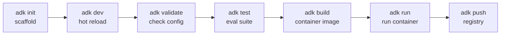
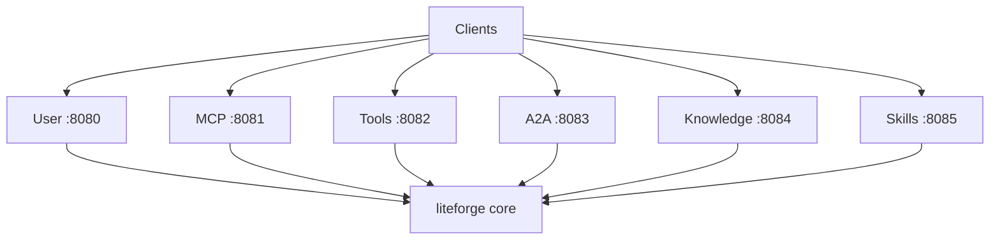

# ADK and Serve

Two ways to run LiteForge as a service rather than a library:

- **`forge adk`** — the **Agent Development Kit**: scaffold, develop, test, build, and run a
  containerized agent project with a defined lifecycle.
- **`forge serve`** — a **multi‑port server** exposing role‑specific HTTP APIs (user, MCP, tools,
  A2A, knowledge, skills).

## Agent Development Kit (`forge adk`)



```bash
forge adk init my-agent     # 1. scaffold project
forge adk dev               # 2. hot-reload dev server
forge adk validate          # 3. validate adk.yaml + artifacts
forge adk test              # 4. run eval suite
forge adk build             # 5. build container image
forge adk run               # 6. run container  (-D for detached)
forge adk push              # 7. push image to a registry
```

### Scaffolded project structure

```
my-agent/
├── adk.yaml              # project manifest
├── .env.example         # environment template
├── agents/
│   └── example.yaml     # agent definitions (YAML)
├── tools/
│   └── example_tool.py  # Python tool implementations
├── knowledge/
│   └── docs/            # knowledge-base documents
├── skills/              # custom skill definitions
└── tests/
    └── test_example.yaml  # eval test cases
```

The `tests/` cases run through the **evals** framework (`forge adk test`), so you can gate builds on
agent quality. See the [`evals`](https://docs.rs/liteforge/latest/liteforge/evals/index.html) module.

## Multi‑port server (`forge serve`)

Start all role servers at once, or just the one you need:

```bash
forge serve                        # all roles
forge serve user                   # only the user-facing API
forge serve mcp                    # only the MCP server
forge serve --user-port 9000       # override a port
forge serve --config ./serve.toml  # custom config
```

### Roles & default ports

| Role | Port | Purpose |
|---|:--:|---|
| User | 8080 | User‑facing chat/completions API |
| MCP | 8081 | Model Context Protocol server |
| Tools | 8082 | Tools REST API |
| A2A | 8083 | Agent‑to‑Agent communication |
| Knowledge | 8084 | Knowledge‑base REST API |
| Skills | 8085 | Skills REST API |



### Configuration (`serve.toml`)

```toml
[user]
host = "127.0.0.1"
port = 8080
enabled = true

[mcp]
port = 8081
enabled = true

[tools]
port = 8082
enabled = true

[a2a]
port = 8083
enabled = true

[knowledge]
port = 8084
enabled = true

[skills]
port = 8085
enabled = true
```

Disable a role by setting `enabled = false`, or run a subset by naming it on the command line.

## Observability infra

`forge infra` manages a Docker‑based observability stack (collector + backends) for local
development:

```bash
forge infra start -d
forge infra status
forge infra logs -f
forge infra stop
```

Pair it with the `otel` feature — see **[Observability and Telemetry](Observability-and-Telemetry)**.

Related: **[CLI](CLI)** · **[Tools and Agents](Tools-and-Agents)**
