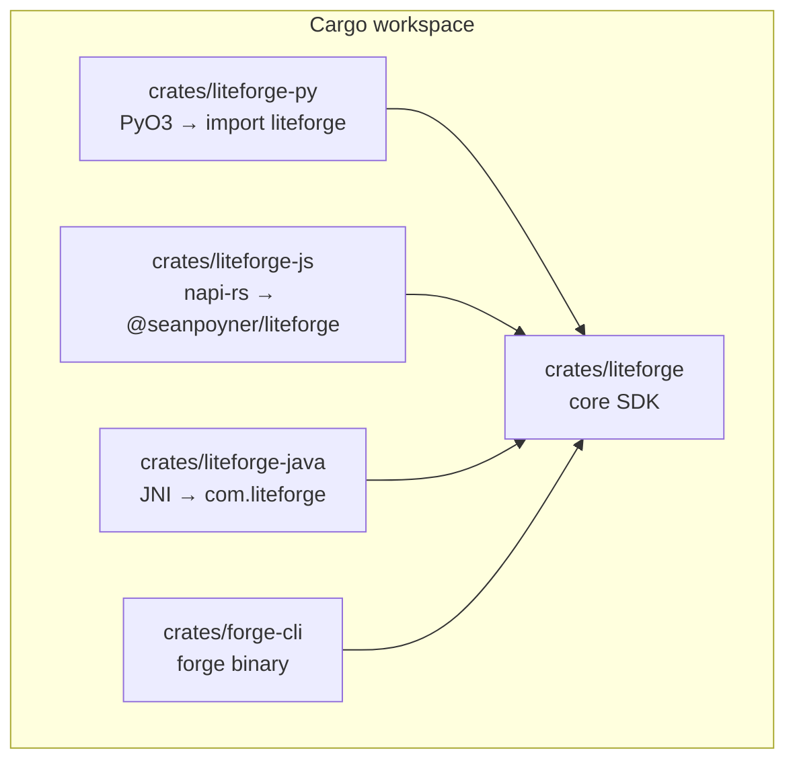
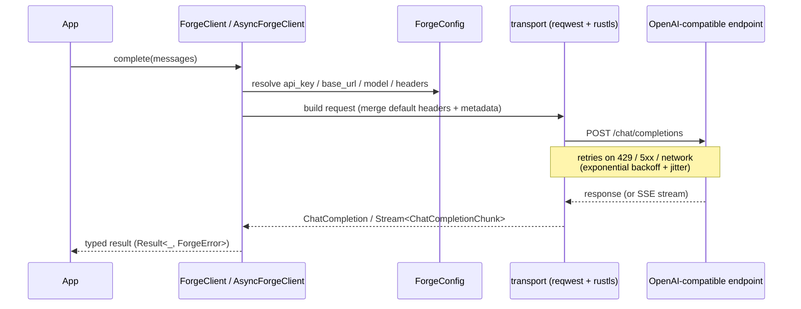
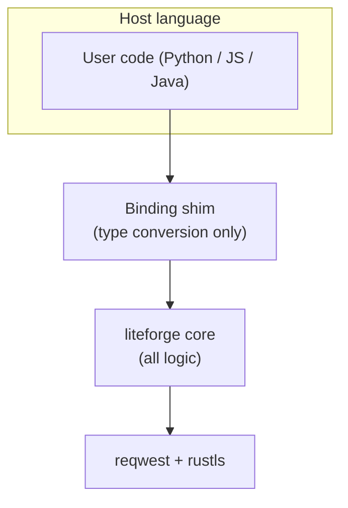
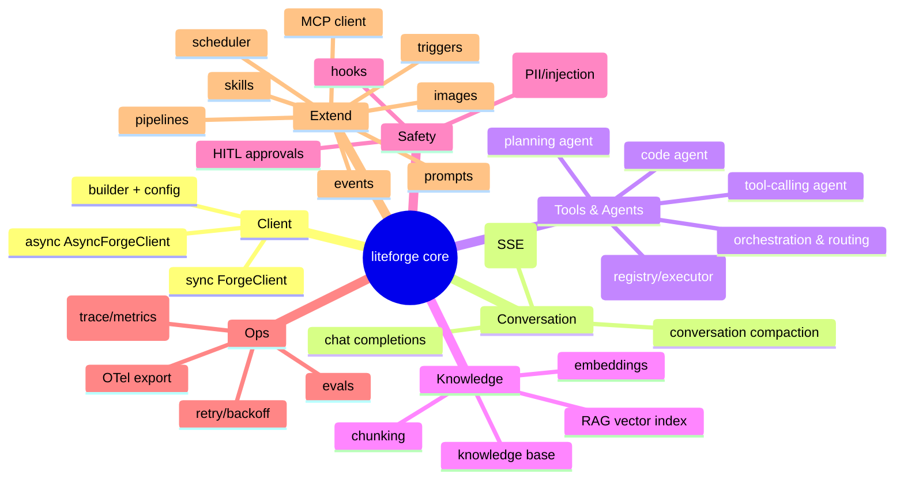

# Architecture

LiteForge is a Cargo **workspace**: one core library, three language bindings, and a CLI — all
sharing the same engine. Write the behavior once in Rust; expose it everywhere.

## Workspace layout

| Crate | Role |
|---|---|
| `crates/liteforge` | The engine: client, types, streaming, tools, agents, RAG, MCP, guardrails, … |
| `crates/liteforge-py` | Python bindings (PyO3, built with maturin) |
| `crates/liteforge-js` | JS/TS bindings (napi‑rs) |
| `crates/liteforge-java` | Java bindings (JNI, experimental) |
| `crates/forge-cli` | The `forge` CLI |

The workspace `Cargo.toml` pins shared dependencies (reqwest + rustls, tokio, serde, the OpenTelemetry
stack) and a single inherited `version`, so a release bumps all crates together.

## Request lifecycle

What happens on a `complete(...)` call:

Key pieces:

- **`config.rs`** resolves settings with the precedence in [Configuration](Configuration).
- **`transport.rs`** owns the reqwest client, header/metadata merging, and the retry hooks.
- **`retry.rs`** decides what's retryable (`is_retryable`) and computes backoff (`RetryConfig`).
- **`streaming.rs`** turns the SSE byte stream into typed `ChatCompletionChunk`s.
- **`error.rs`** maps everything to a single `ForgeError` enum (auth, rate limit, server, network,
  timeout, streaming, serialization, configuration, …).

## Bindings are thin

A binding's job is **type marshaling** — turn a Python dict / JS object / Java object into the core's
`Message`, call the core, convert the result back. No business logic is duplicated, which is why
behavior stays consistent and why CPU‑bound helpers run at Rust speed (see
[Language Bindings](Language-Bindings)).

## The core, by capability

## Design choices

- **OpenAI‑compatible protocol** — chat completions, embeddings, and models endpoints follow the
  OpenAI spec, so any compatible backend (OpenAI, Anthropic, LiteLLM, Ollama, Bedrock via gateway)
  works by changing one base URL.
- **Async‑first, sync‑wrapped** — library code is `async`; `ForgeClient` wraps it with an embedded
  tokio runtime for blocking callers.
- **Trait‑based extensibility** — `Tool`, `Agent`, `Hook`, `Evaluator`, `ApprovalHandler` are traits
  you can implement.
- **rustls + aws‑lc‑rs** — no system OpenSSL dependency; clean cross‑compilation; bundled WebPKI
  roots, with an opt‑in extra‑CA hook (`LITEFORGE_EXTRA_CA_FILE`).
- **Lean by default** — `default = []`; optional integrations (e.g. `otel`) are feature‑gated so
  consumers opt in.

See the [`docs/`](https://github.com/seanpoyner/liteforge/tree/main/docs) tree and
[docs.rs/liteforge](https://docs.rs/liteforge) for module‑level detail.
