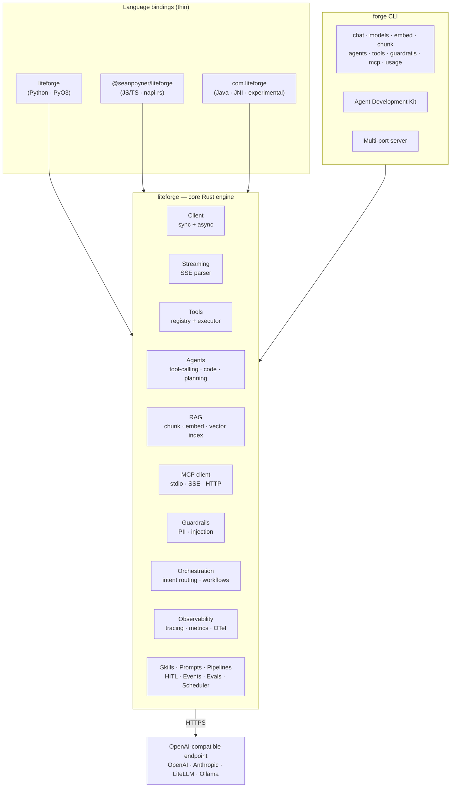

# LiteForge Wiki

**LiteForge** is a high‑performance **Rust SDK for building LLM applications**, with first‑class
bindings for **Python** (PyO3), **JavaScript/TypeScript** (napi‑rs), and **Java** (JNI), plus a
full‑featured **`forge` CLI**. It speaks the **OpenAI‑compatible** wire protocol, so it works with
OpenAI, Anthropic, **LiteLLM**, local **Ollama**, Bedrock (via gateway), or any compatible endpoint.

> One core, written once in Rust. Every binding and the CLI call into the same engine, so behavior
> (streaming, tools, guardrails, retries) is identical across languages.



## Why LiteForge

- **OpenAI‑compatible** — point it at any compatible endpoint via one env var (`LITEFORGE_BASE_URL`).
- **Sync *and* async** — `ForgeClient` (blocking) and `AsyncForgeClient` (tokio) in every language.
- **Batteries included** — tools/function‑calling, agents, RAG, MCP, guardrails, conversation
  compaction, observability, evals, prompts, pipelines, HITL, scheduler — all in the core.
- **Fast** — guardrails/chunking run **2–16× faster** than a pure‑Python implementation (the heavy
  work happens in Rust). See [Language Bindings](Language-Bindings).
- **Local‑first friendly** — first‑class story for **LiteLLM + Ollama** with usage/telemetry
  tracking. See [LiteLLM and Ollama](LiteLLM-and-Ollama).

## 30‑second install

```bash
# CLI (macOS / Linux)
curl -fsSL https://raw.githubusercontent.com/seanpoyner/liteforge/main/scripts/install.sh | bash

# SDKs
cargo add liteforge                  # Rust
pip install liteforge                # Python
npm install @seanpoyner/liteforge    # JavaScript / TypeScript
```

Full matrix and checksum/CA notes: **[Installation](Installation)**.

## Start here

| If you want to… | Go to |
|---|---|
| Make your first call | **[Quickstart](Quickstart)** |
| Understand the moving parts | **[Architecture](Architecture)** |
| Configure keys / endpoints | **[Configuration](Configuration)** |
| Stream tokens as they arrive | **[Streaming](Streaming)** |
| Let the model call your functions | **[Tools and Agents](Tools-and-Agents)** |
| Ground answers in your docs | **[RAG](RAG)** |
| Detect/redact PII & injection | **[Guardrails](Guardrails)** |
| Use LiteLLM + local Ollama | **[LiteLLM and Ollama](LiteLLM-and-Ollama)** |
| Trace and meter usage | **[Observability and Telemetry](Observability-and-Telemetry)** |
| Drive it from the terminal | **[CLI](CLI)** · **[ADK and Serve](ADK-and-Serve)** |
| Use it from Python / JS / Java | **[Language Bindings](Language-Bindings)** |
| Hit a snag | **[FAQ and Troubleshooting](FAQ-and-Troubleshooting)** |
| Contribute / edit this wiki | **[Contributing](Contributing)** |

## Deeper reference

This wiki is a **guided tour**. For exhaustive, type‑level API reference see:

- **Rust API** — [docs.rs/liteforge](https://docs.rs/liteforge)
- **In‑repo docs** — the [`docs/`](https://github.com/seanpoyner/liteforge/tree/main/docs) tree
  (per‑module API pages, guides, CLI reference)
- **Runnable examples** — [`examples/`](https://github.com/seanpoyner/liteforge/tree/main/examples)
  (Rust, Python, JavaScript)

## Project links

[Repository](https://github.com/seanpoyner/liteforge) ·
[crates.io](https://crates.io/crates/liteforge) ·
[PyPI](https://pypi.org/project/liteforge/) ·
[npm](https://www.npmjs.com/package/@seanpoyner/liteforge) ·
[Releases](https://github.com/seanpoyner/liteforge/releases) ·
MIT licensed
