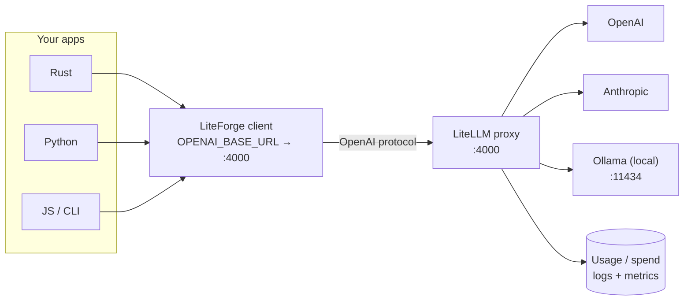

# LiteLLM and Ollama

LiteForge speaks the OpenAI wire format, so the cleanest way to run it in a real setup is to put a
**[LiteLLM](https://github.com/BerriAI/litellm) proxy** in front of every model — cloud and local —
and point LiteForge at that single endpoint. LiteLLM handles model routing, keys, rate limits,
caching, and **usage/telemetry**, while LiteForge stays a thin, fast client that doesn't care which
provider actually served the request.

This is the recommended topology: **one base URL, every model, centralized metering.**



## Option A — LiteForge → LiteLLM → everything (recommended)

### 1. Run a LiteLLM proxy

A minimal `litellm_config.yaml` that exposes a cloud model and a local Ollama model under one roof:

```yaml
model_list:
  - model_name: gpt-4o-mini
    litellm_params:
      model: openai/gpt-4o-mini
      api_key: os.environ/OPENAI_API_KEY

  - model_name: llama3.1            # served by local Ollama
    litellm_params:
      model: ollama/llama3.1
      api_base: http://localhost:11434
```

```bash
litellm --config litellm_config.yaml      # serves on http://localhost:4000
```

### 2. Point LiteForge at the proxy

```bash
export LITEFORGE_BASE_URL="http://localhost:4000/v1"
export LITEFORGE_API_KEY="sk-litellm-…"   # your LiteLLM virtual key (or any string if unauthenticated)
export LITEFORGE_DEFAULT_MODEL="llama3.1" # or gpt-4o-mini — same client, just a model name
```

```rust
use liteforge::{ForgeClient, Message};

let client = ForgeClient::new();          // picks up the env above
let r = client.complete(vec![Message::user("Hello from a local model!")]).unwrap();
println!("{}", r.content().unwrap_or(""));
```

Switching from a local model to a frontier model is now just changing the model string — no code,
no endpoint change:

```rust
let r = client
    .complete_with_model("gpt-4o-mini", vec![Message::user("Now use the cloud model")])
    .unwrap();
```

> **Drop‑in tip:** LiteForge also reads `OPENAI_BASE_URL`/`OPENAI_API_KEY` as fallbacks (see
> [Configuration](Configuration)). If your environment already exports those for the OpenAI SDK,
> LiteForge will follow them to the same LiteLLM proxy with zero extra config.

### 3. Track usage & telemetry centrally

Because every call flows through LiteLLM, you get one place to meter spend and latency across all
models — cloud and local. Enable LiteLLM's logging/telemetry (its database/Prometheus/callback
options) and LiteForge requests show up there automatically. To attach per‑request attributes
(team, app, user) so they're queryable in LiteLLM, set default metadata on the LiteForge side:

```bash
export LITEFORGE_DEFAULT_METADATA='{"app":"support-bot","team":"platform"}'
```

That JSON is merged into every request body's `metadata`, so your proxy/observability stack can
slice usage by it. For client‑side tracing/metrics, see
**[Observability and Telemetry](Observability-and-Telemetry)**.

## Option B — LiteForge → Ollama directly (no proxy)

For local‑only experiments you can skip LiteLLM and hit Ollama's OpenAI‑compatible endpoint:

```bash
# Start Ollama and pull a model
ollama serve
ollama pull llama3.1

export LITEFORGE_BASE_URL="http://localhost:11434/v1"
export LITEFORGE_API_KEY="ollama"          # Ollama ignores the key; any non-empty string works
export LITEFORGE_DEFAULT_MODEL="llama3.1"
```

```python
from liteforge import ForgeClient
client = ForgeClient()
print(client.complete([{"role": "user", "content": "Hi, local Llama!"}])
      ["choices"][0]["message"]["content"])
```

You lose central metering and multi‑provider routing, but it's the fastest path to a fully offline
loop. Move to **Option A** when you want one endpoint for both local and cloud models.

## Which should I use?

| Goal | Use |
|---|---|
| One endpoint for cloud **and** local models | **A** (LiteLLM proxy) |
| Centralized usage/spend/telemetry | **A** |
| Virtual keys, rate limits, caching, fallbacks | **A** |
| Quick offline test, single local model | **B** (direct Ollama) |

## Tool calling with local models

Function‑calling quality varies by local model. If a model emits no `tool_calls`, prefer one with
native tool support (e.g. a granite/llama variant that advertises tools) and keep schemas small.
See **[Tools and Agents](Tools-and-Agents)**.

Related: **[Configuration](Configuration)** · **[Observability and Telemetry](Observability-and-Telemetry)** · **[CLI](CLI)**
