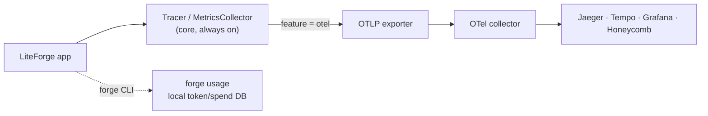

# Observability and Telemetry

LiteForge gives you three complementary layers of visibility:

1. **Built‑in tracing & metrics** — `Tracer`, `Span`, `MetricsCollector` in the core, always
   available, no external dependencies.
2. **OpenTelemetry export** — behind the `otel` feature flag, ship spans/metrics to any OTLP
   collector (Jaeger, Tempo, Grafana, Honeycomb, …).
3. **CLI usage tracking** — `forge usage` records and reports token/spend usage locally.

For *server‑side* metering across many models, also see the LiteLLM proxy approach in
**[LiteLLM and Ollama](LiteLLM-and-Ollama)** — the two layers complement each other (client traces
+ proxy spend reports).



## Built‑in tracing

```rust
use liteforge::observability::{Tracer, SpanKind};

let tracer = Tracer::new("my-service");

let mut span = tracer.start_span("handle_request");
span.set_attribute("user.tier", "pro");
// … do work …
span.end();

// Drain finished spans (e.g. to log or forward them)
for s in tracer.drain_spans() {
    println!("{} took {:?}", s.name, s.duration());
}
```

## Built‑in metrics

```rust
use liteforge::observability::MetricsCollector;

let metrics = MetricsCollector::new();
metrics.increment("requests", 1);
metrics.record_duration("llm_latency_ms", 842.0);
metrics.gauge("queue_depth", 3.0);

let snapshot = metrics.snapshot();   // counters, histograms, gauges at a point in time
```

## OpenTelemetry export

Enable the feature in `Cargo.toml`:

```toml
liteforge = { version = "0.2", features = ["otel"] }
```

Configure via standard OTel environment variables and initialize the exporter:

```bash
export OTEL_EXPORTER_OTLP_ENDPOINT="http://localhost:4317"
export OTEL_SERVICE_NAME="liteforge-app"
export OTEL_RESOURCE_ATTRIBUTES="deployment.environment=staging"
```

```rust
// requires the `otel` feature
liteforge::otel_init::init_otel().expect("init OTLP exporter");
```

### Capturing prompt/completion text

By default, span data **excludes** prompt and completion text (to avoid leaking sensitive content).
Opt in only when you need it and understand the privacy implications:

```bash
export LITEFORGE_OTEL_CAPTURE_PROMPTS=true
```

Or programmatically through `OtelConfig` (`capture_prompts`, `service_name`, `endpoint`,
`resource_attributes`).

> ⚠️ Enabling prompt capture writes user inputs and model outputs into your traces. Make sure your
> telemetry backend's retention and access controls are appropriate before turning it on.

## CLI usage tracking

The `forge` CLI records usage locally and reports it on demand:

```bash
forge usage                    # current-period summary
forge usage --period weekly    # daily | weekly | monthly | quarterly | yearly
forge usage --by-model         # breakdown by model
forge usage --sessions         # list tracked sessions
forge usage --csv              # export
```

`forge claude` (launching Claude Code through LiteForge) also tracks usage unless you pass
`--no-track`.

## Python / JavaScript

The `Tracer` and `MetricsCollector` types are exposed in the Python and JS bindings as well, with the
same shape — create a tracer, start/end spans, snapshot metrics. See
[`docs/guides/observability.md`](https://github.com/seanpoyner/liteforge/blob/main/docs/guides/observability.md)
and the [`observability`](https://docs.rs/liteforge/latest/liteforge/observability/index.html) module.

Related: **[LiteLLM and Ollama](LiteLLM-and-Ollama)** · **[Configuration](Configuration)**
