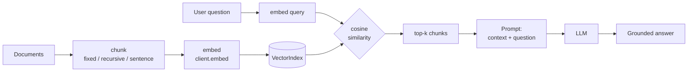

# RAG (Retrieval‑Augmented Generation)

RAG grounds the model in **your** content: split documents into chunks, embed them into vectors,
retrieve the closest chunks to a question, and feed those into the prompt. LiteForge ships the whole
pipeline — chunking, embeddings, an in‑memory `VectorIndex`, similarity math, and a `RagPipeline`.



## Step 1 — Chunk

```rust
use liteforge::{chunk, ChunkingStrategy};

let chunks = chunk(document_text, ChunkingStrategy::Recursive, 500, 50);
// size = 500 chars per chunk, overlap = 50
```

Strategies: `Fixed`, `Recursive` (default), `Sentence`. From the CLI:

```bash
forge chunk report.txt --size 500 --overlap 50 --strategy recursive
```

## Step 2 — Embed and index

```rust
use liteforge::AsyncForgeClient;
use liteforge::rag::{VectorIndex, EmbeddedDocument};

let client = AsyncForgeClient::new();
let mut index = VectorIndex::new();

for (i, c) in chunks.iter().enumerate() {
    let emb = client.embed(&c.text).await.unwrap();         // Vec<f32>
    let vector = emb.data[0].embedding.clone();
    index.add(EmbeddedDocument::new(format!("chunk-{i}"), &c.text, vector));
}
```

## Step 3 — Retrieve

```rust
let q_emb = client.embed("How do I rotate API keys?").await.unwrap();
let hits = index.search(&q_emb.data[0].embedding, 4);       // top-4

for hit in &hits {
    println!("score={:.3}  {}", hit.score, hit.document.content);
}
```

The `rag` module also exposes the underlying math if you want to build your own retriever:
`cosine_similarity`, `dot_product`, `euclidean_distance`, `normalize`.

## Step 4 — Generate with context

Assemble the retrieved chunks into the prompt and ask the model:

```rust
use liteforge::Message;

let context = hits.iter()
    .map(|h| h.document.content.as_str())
    .collect::<Vec<_>>()
    .join("\n---\n");

let answer = client.complete(vec![
    Message::system("Answer using ONLY the provided context. If unsure, say so."),
    Message::user(format!("Context:\n{context}\n\nQuestion: How do I rotate API keys?")),
]).await.unwrap();

println!("{}", answer.content().unwrap_or(""));
```

## Or use the pipeline

`RagPipeline` wires retrieval + prompt assembly + generation together so you call it in one shot:

```rust
use liteforge::rag::RagPipeline;

let pipeline = RagPipeline::builder()
    .retriever(index)
    // .ranker(None)            // optional re-ranking
    // .prompt_template(...)    // optional custom template
    .build();

let answer = pipeline.run(&client, "How do I rotate API keys?").await.unwrap();
```

## Python

```python
from liteforge import VectorIndex, EmbeddedDocument, cosine_similarity

index = VectorIndex()
for i, text in enumerate(chunks):
    vec = client.embed(text)["data"][0]["embedding"]
    index.add(EmbeddedDocument(f"chunk-{i}", text, vec))

q = client.embed("How do I rotate API keys?")["data"][0]["embedding"]
for hit in index.search(q, 4):
    print(hit.score, hit.document.content)
```

## Knowledge base alternative

If you want document CRUD + search without managing vectors yourself, use the `knowledge` module
(`LocalKnowledgeBackend`, `KnowledgeClient`) — upload documents, then `search(query, options)` with a
score threshold. See the
[`knowledge`](https://docs.rs/liteforge/latest/liteforge/knowledge/index.html) module.

## Notes

- **Persistence:** `VectorIndex` is in‑memory. For durability, persist your `(id, vector, text)`
  tuples and rebuild on startup, or back retrieval with an external vector DB and feed results into
  the same prompt‑assembly step.
- **Embeddings model:** controlled by your endpoint/model config. Use `client.embed_batch(texts)`
  to embed many chunks in one request.

Source: [`rag.rs`](https://github.com/seanpoyner/liteforge/blob/main/crates/liteforge/examples/rag.rs),
[`knowledge.rs`](https://github.com/seanpoyner/liteforge/blob/main/crates/liteforge/examples/knowledge.rs),
guide: [`docs/guides/rag.md`](https://github.com/seanpoyner/liteforge/blob/main/docs/guides/rag.md).
