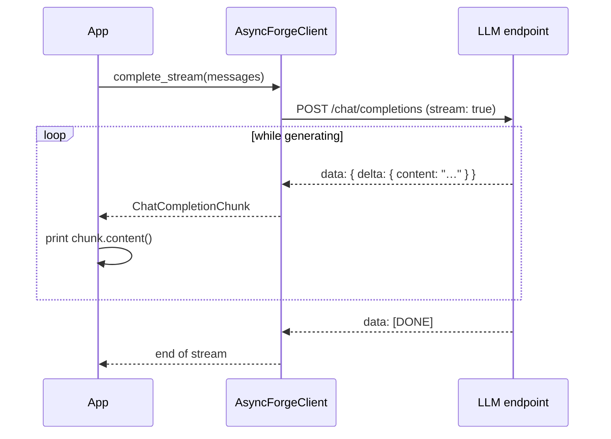

# Streaming

LiteForge streams completions over **Server‑Sent Events (SSE)**. Instead of waiting for the whole
response, you receive `ChatCompletionChunk`s as the model generates them and print tokens as they
arrive.



Each chunk carries a partial **delta** (`choices[0].delta.content`). Concatenate deltas to rebuild
the full message; watch `finish_reason` on the final chunk to know why generation stopped.

## Rust

```rust
use liteforge::{AsyncForgeClient, Message};
use tokio_stream::StreamExt;

#[tokio::main]
async fn main() {
    let client = AsyncForgeClient::new();

    let mut stream = client
        .complete_stream(vec![Message::user("Tell me a story")])
        .await
        .unwrap();

    while let Some(chunk) = stream.next().await {
        if let Ok(chunk) = chunk {
            if let Some(text) = chunk.content() {
                print!("{text}");
            }
        }
    }
}
```

> `chunk.content()` is a convenience that returns `choices[0].delta.content`. Errors mid‑stream
> surface as `Err(ForgeError)` items — handle them inside the loop rather than unwrapping.

## Python

```python
import asyncio
from liteforge import AsyncForgeClient

async def main():
    client = AsyncForgeClient()
    stream = await client.complete_stream([
        {"role": "user", "content": "Tell me a story"},
    ])
    async for chunk in stream:
        delta = chunk["choices"][0]["delta"].get("content")
        if delta:
            print(delta, end="", flush=True)

asyncio.run(main())
```

## JavaScript / TypeScript

```javascript
import { AsyncForgeClient, createMessageUser } from '@seanpoyner/liteforge';

const client = new AsyncForgeClient();
const stream = await client.completeStream([
  createMessageUser('Tell me a story'),
]);

let chunk;
while ((chunk = await stream.next()) !== null) {
  const content = chunk.choices[0]?.delta?.content;
  if (content) process.stdout.write(content);
}
```

## CLI

```bash
forge chat --stream "Tell me a story"
```

## Accumulating the full response

When you also need the complete text (e.g. to store it), append deltas as you go:

```rust
let mut full = String::new();
while let Some(Ok(chunk)) = stream.next().await {
    if let Some(text) = chunk.content() {
        print!("{text}");
        full.push_str(text);
    }
}
// `full` now holds the entire message
```

## Tips

- **Flush stdout** as you print (Python's `flush=True`, Node's `process.stdout.write`) so tokens
  appear immediately rather than buffering by line.
- **Timeouts** apply to establishing the stream; long generations are fine. Tune with
  `LITEFORGE_TIMEOUT` or `.timeout_secs(...)`.
- Streaming composes with tools and agents — see **[Tools and Agents](Tools-and-Agents)**.

Source examples: [`examples/javascript/streaming.mjs`](https://github.com/seanpoyner/liteforge/blob/main/examples/javascript/streaming.mjs),
[`crates/liteforge/examples/streaming.rs`](https://github.com/seanpoyner/liteforge/blob/main/crates/liteforge/examples/streaming.rs).
