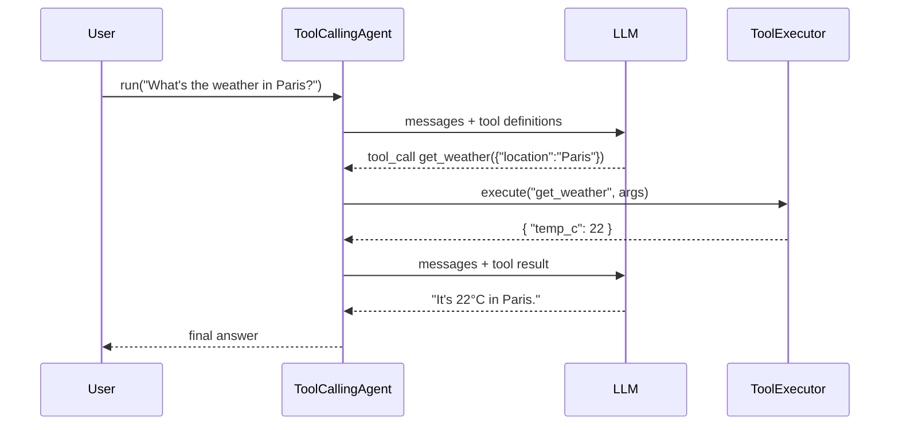

# Tools and Agents

LiteForge gives the model **tools** (functions it can call) and provides an **agent** that runs the
call/observe/respond loop for you.

- A **Tool** is a named function with a JSON‑Schema parameter spec and an `execute` body.
- A **ToolRegistry** holds your tools; a **ToolExecutor** validates arguments and invokes them.
- A **ToolCallingAgent** wires a registry to a client and loops until the model produces a final
  answer.

## The agent loop



The loop repeats — model may call several tools across multiple turns — until it returns a message
with no further tool calls (or a step limit is hit).

## Define a tool

### Rust

Implement the `Tool` trait, or wrap a closure with `FnTool`:

```rust
use liteforge::tools::{Tool, ToolRegistry, ToolExecutor};
use serde_json::{json, Value};

struct WeatherTool;

impl Tool for WeatherTool {
    fn name(&self) -> &str { "get_weather" }
    fn description(&self) -> &str { "Get current weather for a location" }

    fn parameters_schema(&self) -> Value {
        json!({
            "type": "object",
            "properties": { "location": { "type": "string" } },
            "required": ["location"]
        })
    }

    fn execute(&self, args: Value) -> Result<Value, String> {
        let loc = args["location"].as_str().unwrap_or("unknown");
        Ok(json!({ "location": loc, "temp_c": 22 }))
    }
}

let mut registry = ToolRegistry::new();
registry.register(Box::new(WeatherTool));

let executor = ToolExecutor::new(registry);
let result = executor.execute("get_weather", json!({ "location": "Paris" }));
```

### Python

```python
from liteforge import create_tool, ToolRegistry, ToolExecutor

def get_weather(args: dict) -> dict:
    return {"location": args["location"], "temp_c": 22}

weather = create_tool(
    name="get_weather",
    description="Get current weather for a location",
    parameters={
        "type": "object",
        "properties": {"location": {"type": "string"}},
        "required": ["location"],
    },
    func=get_weather,
    requires_confirmation=False,
)

registry = ToolRegistry()
registry.register(weather)

executor = ToolExecutor(registry, validate_args=True)
print(executor.execute("get_weather", {"location": "Paris"}))
```

### JavaScript / TypeScript

```javascript
import { ToolRegistry, ToolExecutor } from '@seanpoyner/liteforge';

const registry = new ToolRegistry();
registry.register(
  'get_weather',
  'Get current weather for a location',
  { type: 'object', properties: { location: { type: 'string' } }, required: ['location'] },
  (argsJson) => {
    const { location } = JSON.parse(argsJson);
    return JSON.stringify({ location, temp_c: 22 });
  },
);

const executor = new ToolExecutor(registry);
console.log(executor.execute('get_weather', { location: 'Paris' }));
```

## Let an agent drive the tools

Instead of calling the executor yourself, hand the registry and a client to a `ToolCallingAgent`
and let it run the loop:

```rust
use liteforge::{AsyncForgeClient};
use liteforge::agents::ToolCallingAgent;
use liteforge::tools::ToolRegistry;

#[tokio::main]
async fn main() {
    let client = AsyncForgeClient::new();

    let mut registry = ToolRegistry::new();
    registry.register(Box::new(WeatherTool));

    let agent = ToolCallingAgent::new(client, registry)
        .with_system_prompt("You are a concise weather assistant.");

    let answer = agent.run("What's the weather in Paris?").await.unwrap();
    println!("{answer}");
}
```

## Argument validation & confirmation

- The `ToolExecutor` validates arguments against each tool's JSON Schema before calling it; a schema
  mismatch returns an error instead of running your code.
- Mark a tool as **requiring confirmation** (`requires_confirmation` / `require_confirmation(true)`)
  to gate destructive actions. Combine with **Human‑in‑the‑Loop** approval handlers for risk‑based
  gating (see the [`hitl`](https://docs.rs/liteforge/latest/liteforge/hitl/index.html) module).

## Beyond tool‑calling agents

The core also ships:

- **CodeAgent** — generates and runs code in a sandbox (`ProcessSandbox` / `MockSandbox`).
- **PlanningAgent** — produces a multi‑step `Plan` before acting.
- **Orchestration** — route between multiple agents by intent, or run sequential/parallel workflows
  (`AgentOrchestrator`, `IntentRouter`, `WorkflowExecutor`).

See the [`agents`](https://docs.rs/liteforge/latest/liteforge/agents/index.html) and
[`orchestration`](https://docs.rs/liteforge/latest/liteforge/orchestration/index.html) modules, and
the [`docs/guides/agents.md`](https://github.com/seanpoyner/liteforge/blob/main/docs/guides/agents.md)
guide.

Source examples: [`tools.rs`](https://github.com/seanpoyner/liteforge/blob/main/crates/liteforge/examples/tools.rs),
[`agent.rs`](https://github.com/seanpoyner/liteforge/blob/main/crates/liteforge/examples/agent.rs),
[`examples/python/tools.py`](https://github.com/seanpoyner/liteforge/blob/main/examples/python/tools.py).
